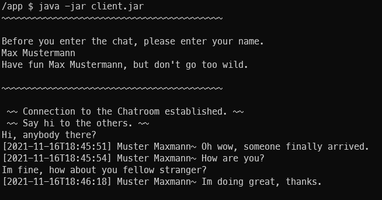
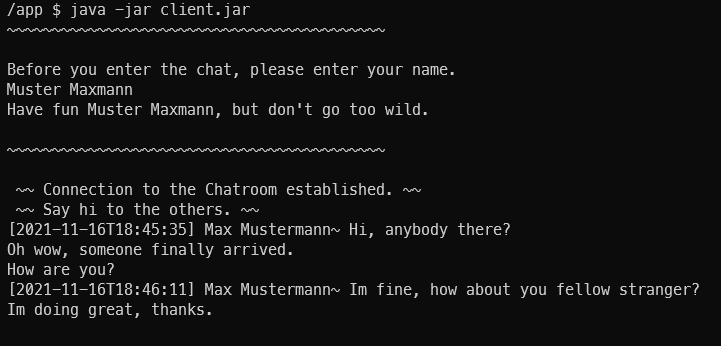
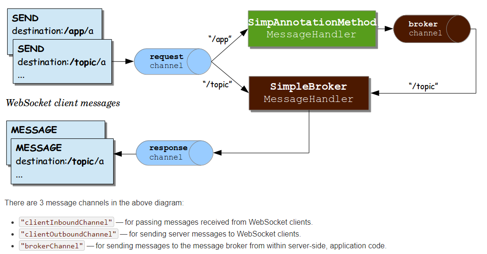

# chatty

A real-time chat application.

# table of content

- [how to run](#how-to-run)
- [application in use](#application-in-use)
- [technical overview](#technical-overview)
- [server & client](#server--client)
    - [server](#server)
    - [client](#client)
- [testing](#testing)

# how to run

The server can be started inside an IDE, during development or any other reason where you want to start it inside an
IDE. Start the server as a (Spring) WebApplication.

The other (more useful) approach is with docker. Run the following command:

- `docker run -d -p 8080:8080 --name chatty-server anjeyy/chatty:server-latest`

In order to start the client:

- download the jar file first from https://github.com/anjeyy/chatty
- open a terminal
- navigate to the folder where you downloaded the `client.jar`-file
- execute following command: `java -jar client.jar`
- follow the instructions displayed at the terminal

# application in use

Two snippets displaying the use of two clients and chatting with each other.

**Client One**


**Client Two**


# technical overview

A good graphical overview on how the websocket implementation provided by the _Spring Framework_ works is in the
following diagram. Source
is [Spring documentation](https://docs.spring.io/spring-framework/docs/4.3.x/spring-framework-reference/html/websocket.html)
itself.


> Source: https://docs.spring.io/spring-framework/docs/4.3.x/spring-framework-reference/html/websocket.html

**Note:** Mentioned _clientInboundChannel_ and _clientOutboundChannel_ are `request channel` and
respectively `response channel` in the diagram.

# server & client

Server side implementation is done with _Spring_, the client is also a _Spring application_, but without a server
component. It's executed with a commandline runner since messages are sent within the client application, there is no
need to start opening ports for communication of any kind.

Both application parts communicate with a `JSON` format. An example:

```json
{
  "message": "a simple message",
  "author": "a very special username",
  "created": "2021-11-16T18:34:21"
}
```

## server

In case of receiving an invalid message, an _exception_ is thrown. So currently server is only distributing the
messages. For future features there can be an auditing, encryption.

## client

Currently, the client is also a _Java_ application, but it is also possible to extend the offer with an angular and/or
android application. Whatever has the potential to connect to a _websocket_ can be considered for future client use.

The Java client has a rich reconnect feature. If the server crashes, the client loses the connection and tries to
reconnect, if the user triggers the reconnection. Reconnect is triggered with sending a message (when no connection is
currently established).

Also, when starting the client and there is no possibility of establishing a connection to the server right away, a
reconnection is immediately triggered.

In case if there is no chance to establish a connection after various reconnection attempts (configurable), the client
application closes. Then is a relaunch recommended.

# testing

A big question was how to test the client and server interaction.

My first and initial approach was to use [testcontainers](https://www.testcontainers.org/). An example can be seen when
navigating to [SingleClientConnectionIT](
client/src/test/java/com/github/anjeyy/client/integration/SingleClientConnectionIT.java). A big challenge was to create
a client container and bind the STDIN inside the docker container, when executing to simulate user input. The problem
with _testcontainers_ was, that I could **not** start the client container in an interactive way with `tty`.
So `docker run -it ...` was not possible, that's why I decided to move the integration tests as part of _github actions_
with shell scripts where docker is fully functional.

Integration tests are executed with docker container starting both server and client with various test scenarios
(chatting, reconnecting). The previous won insight polluting the docker STDIN and simulating user input is also part of
the integration test [source](https://stackoverflow.com/a/62142025/11770752). To verify wanted behaviour, `docker logs`
are being evaluated and asserted.
